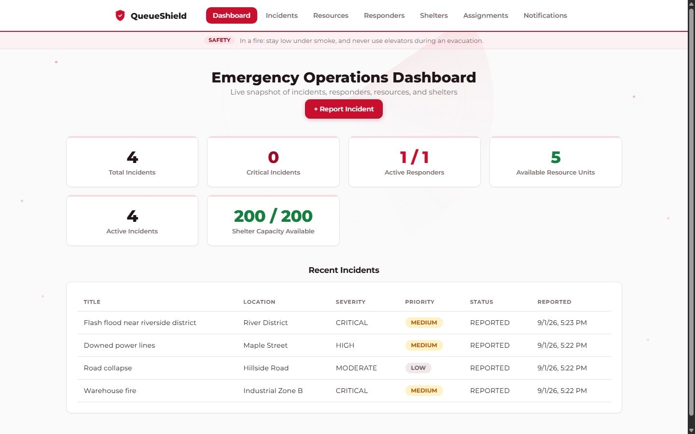
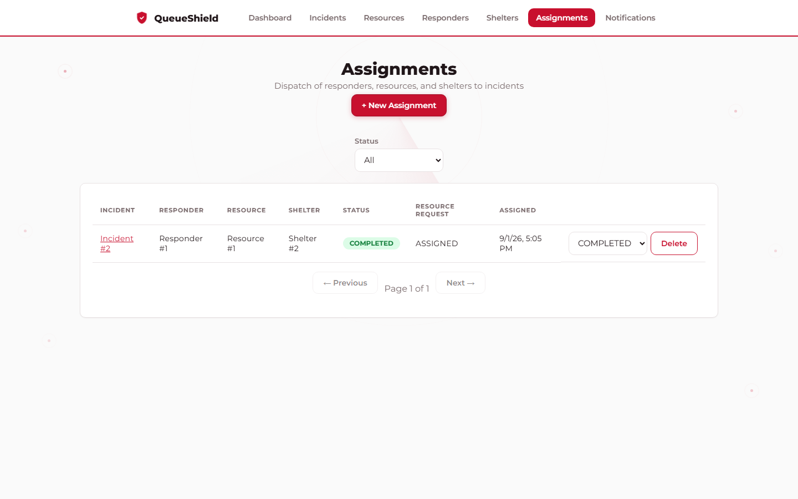
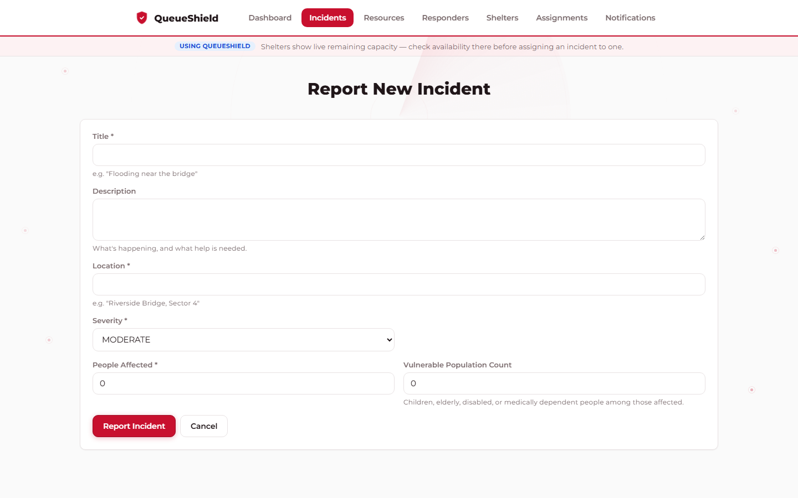

# QueueShield — Smart Emergency Resource Coordination Platform

**Phase 2: event-driven microservices — 7 Spring Boot services + an API gateway, Kafka,
Redis, and service-owned Postgres databases, still fully local and free to run.**

Phase 1 (a single Spring Boot monolith) is preserved in [`backend/`](backend) for reference and
is no longer actively developed — see [Phase 1 history](#phase-1-history-superseded) at the
bottom of this document.

**Stack:** Java 21 · Spring Boot 3 · Spring Cloud Gateway · Apache Kafka (KRaft) · Redis ·
PostgreSQL · Angular 19 · Docker · Kubernetes (Helm) · Terraform · Ansible · PowerShell

**Run it:** `docker compose up -d` gets the whole stack running locally in one command — see
[Local development setup](#local-development-setup).

<p align="center">
  
</p>
<p align="center">
  
  
</p>

<details>
<summary><strong>Table of contents</strong></summary>

- [Problem](#problem)
- [Why microservices, and why these boundaries](#why-microservices-and-why-these-boundaries)
- [Architecture](#architecture)
- [Kafka: what it solves here, and the event catalog](#kafka-what-it-solves-here-and-the-event-catalog)
- [Redis: what it's for, and cache invalidation](#redis-whats-it-for-and-cache-invalidation)
- [API boundaries](#api-boundaries)
- [Local development setup](#local-development-setup)
- [API examples (through the gateway)](#api-examples-through-the-gateway)
- [Testing](#testing)
- [Docker Compose, Kubernetes, Terraform, and Ansible](#docker-compose-kubernetes-terraform-and-ansible)
- [Phase 1 history (superseded)](#phase-1-history-superseded)
</details>

## Problem

When an emergency happens — a flood, a fire, a building collapse — coordinators have to triage:
which incidents need attention *right now*, and which responders, vehicles, medical supplies,
and shelters are actually free to send? QueueShield gives coordinators a single system to log
incidents, see them ranked by an explainable priority score, track responder/resource/shelter
availability, and dispatch them — with double-dispatch prevented automatically.

## Why microservices, and why these boundaries

Splitting the Phase 1 monolith wasn't "cut every table into its own service" — it followed the
actual bounded contexts:

- **Incident Management** (`incident-service`) and **Prioritization** (`priority-service`) used
  to be one class (`IncidentService`) doing two unrelated jobs: owning the incident record, and
  scoring it. Those have different reasons to change — the scoring algorithm is the one piece
  most likely to be replaced by an ML model later — so they're two services now. Priority is a
  *derived* value: `priority-service` computes and owns it authoritatively; `incident-service`
  keeps a read-through copy (updated asynchronously) so a single GET doesn't require a fan-out
  call.
- **Resource / Responder / Shelter** (`resource-service` / `responder-service` /
  `shelter-service`) were already reasonably separable and stay that way — each owns its own
  inventory/roster and is the only writer of its own state.
- **Assignment** (`assignment-service`) is the orchestrator. It references incident/responder/
  resource/shelter only by id (a plain `Long`, not a JPA relation) — there is no cross-service
  database to join across.
- **Notification** (`notification-service`) is new: a pure fan-out consumer with its own tiny
  log, reacting to events nothing in Phase 1 had a place to react to.

**Sync vs. async is chosen per operation, not dogmatically:**

| Interaction | Mechanism | Why |
|---|---|---|
| Incident created/updated → priority computed | async event (`IncidentCreated`/`IncidentUpdated` → `IncidentPrioritized`) | Recomputation is a pure function of incident state, so at-least-once redelivery is harmless, and nothing needs the score in the same request. |
| Assignment dispatches a **responder** | sync REST (assignment → responder-service) | Dispatch must not race — two coordinators can't both successfully dispatch the same unit. `ResponderAssigned` is published *after* success purely as a fan-out fact. |
| Assignment reserves a **resource** | async request/reply (`ResourceRequested` → `ResourceAssigned`/`ResourceRequestRejected`) | The one deliberate saga in this system: resource-service arbitrates contention independently, and the caller doesn't need the answer in the same millisecond. |
| Shelter capacity changes | async fact event (`ShelterCapacityChanged`) | Purely informational to everyone except shelter-service itself. |
| Assignment reaches a terminal state | async fact event (`AssignmentCompleted`) | Same — an announcement, not a request. |
| Releasing a held responder/resource | sync REST | Release doesn't need arbitration (that's what justified async for *reserving*), so a plain compensating call is simpler and just as correct. |

## Architecture

```
QueueShield/
├── backend/                    Phase 1 monolith (superseded, kept for reference)
├── services/                   Phase 2 microservices (Maven reactor, shared build config only)
│   ├── incident-service/       :8083  incident_db
│   ├── priority-service/       :8084  priority_db   + Redis
│   ├── resource-service/       :8085  resource_db   + Redis
│   ├── responder-service/      :8086  responder_db  + Redis
│   ├── shelter-service/        :8087  shelter_db    + Redis
│   ├── assignment-service/     :8088  assignment_db
│   ├── notification-service/   :8089  notification_db
│   └── gateway/                :8090  (routing + rate limiting, no DB)
├── frontend/                   Angular 19 dashboard - talks to the gateway only
└── docs/
```

```
                     ┌──────────────┐
   Angular  ───────► │   gateway    │  (routes /api/**, rate-limits POST /api/incidents)
  (browser)           └──────┬───────┘
                              │  REST (all 7 services reachable via the gateway)
        ┌─────────────┬──────┴──────┬─────────────┬──────────────┐
        ▼             ▼             ▼             ▼              ▼
  incident-svc   responder-svc  resource-svc  shelter-svc   assignment-svc ─── notification-svc
        │                                          ▲               │  ▲              ▲
        │ IncidentCreated/Updated                  │               │  │ResourceRequested
        ▼                                          │ShelterCapacityChanged             │
  priority-svc ──IncidentPrioritized──► Kafka ◄─────┘               │  │ResourceAssigned/Rejected
        ▲                                                            ▼  │
        └── GET availability-ratio (sync, Redis-cached) ──── resource-svc
```

assignment-service calls responder-service **synchronously** (dispatch/release) and talks to
resource-service both ways: **synchronously** for release, **asynchronously** via Kafka for
reservation. Every arrow into `notification-service` is a Kafka event it only ever consumes.

### Data ownership

Every service has its **own Postgres database** (`incident_db`, `priority_db`, `resource_db`,
`responder_db`, `shelter_db`, `assignment_db`, `notification_db`) — not a shared schema. For
local development they all live inside one shared Postgres *instance* (one container, one
process) rather than seven separate instances, purely to economize on this dev machine's
resources; nothing about the code assumes that. Each database is a fully separate Postgres
database (not a schema-within-a-database), so no cross-service SQL join is even possible —
moving one service's database onto its own physical instance later is a `DB_URL` change, not a
code change. No service ever queries another service's database.

## Kafka: what it solves here, and the event catalog

Kafka is what lets `priority-service`, `resource-service`, and `notification-service` react to
things happening in other services **without those services knowing they exist** — incident-service
has no idea priority-service or notification-service are listening; it just publishes what
happened. That decoupling is the actual payoff, not "Kafka is on the resume" — see the sync/async
table above for the cases where a direct call was the better (and simpler) choice instead.

| Topic | Producer | Consumer(s) | Payload |
|---|---|---|---|
| `incident.created` | incident-service | priority-service | current incident state |
| `incident.updated` | incident-service | priority-service | current incident state |
| `incident.prioritized` | priority-service | incident-service, notification-service (CRITICAL only) | score, tier, computedAt |
| `resource.requested` | assignment-service | resource-service | assignmentId, resourceId, incidentId |
| `resource.assigned` | resource-service | assignment-service | assignmentId, resourceId, incidentId |
| `resource.request-rejected` | resource-service | assignment-service, notification-service | assignmentId, resourceId, reason |
| `responder.assigned` | responder-service | *(fan-out, no consumer yet in this phase)* | assignmentId, responderId, incidentId |
| `shelter.capacity-changed` | shelter-service | notification-service (low-capacity only) | shelterId, capacity fields |
| `assignment.completed` | assignment-service | notification-service | assignmentId, incident/responder/resource/shelter ids |

Every producer/consumer pair uses **`spring.json.type.mapping`** with a shared alias (e.g.
`incidentEvent`) rather than each side referencing the other's Java class by fully-qualified name
— the wire contract (a JSON shape plus an alias string) is the actual boundary between services,
not a shared JAR. Each consuming service keeps its own local copy of the event record it needs.

### Retry, dead-letter, and deserialization failures

Every consumer shares the same policy (`config/KafkaConfig.java` in each service): 3 retries with
exponential backoff (0.5s → 1s → 2s, capped at 4s total), then the record is published to
`<topic>.DLT` instead of blocking the partition forever or being silently dropped. A **deserialization**
failure (a message whose class isn't in this consumer's trusted packages, or malformed JSON)
happens *before* the listener even runs and — unless you know to guard against it — crashes the
consumer thread in an infinite loop rather than triggering that retry/DLT policy at all. Every
consumer here wraps its JSON deserializer in Spring Kafka's `ErrorHandlingDeserializer` for
exactly this reason (found the hard way: a stray test message on a shared topic with a
foreign class name froze `notification-service`'s consumer until this was added).

### Idempotency — three different techniques for three different situations

At-least-once delivery means every consumer can see the same message twice. What "processing
twice safely" requires depends on what the handler actually does:

1. **Idempotent by construction** (`incident-service` applying `IncidentPrioritized`): recomputing
   and overwriting a cached score with the same value twice is harmless. The only real risk is an
   *older* redelivered event overwriting a newer one, guarded by a monotonic `computedAt` timestamp
   check (`Incident#applyPriorityIfNewer`) — no extra storage needed.
2. **Dedup table with a unique constraint** (`resource-service` handling `ResourceRequested`):
   reserving a unit is *not* naturally idempotent — replaying "decrement by one" twice
   double-decrements. `ResourceReservation` has a unique constraint on `assignmentId` (the natural
   business key, since one assignment requests a resource at most once); a duplicate request finds
   the existing row and re-publishes the same outcome instead of reserving again.
3. **Idempotent by state-check** (`assignment-service` handling `ResourceAssigned`/`Rejected`):
   `resourceRequestStatus` only ever transitions `PENDING → ASSIGNED` or `PENDING → REJECTED`
   once; a redelivered duplicate finds the assignment already past `PENDING` and is a no-op.

`notification-service` deliberately uses **none** of these — a duplicate notification from
redelivery is an acceptable cost for an append-only alert feed, and over-notifying is a much
safer failure mode than under-notifying a critical alert.

## Redis: what it's for, and cache invalidation

Three different caches, two different invalidation strategies, chosen by who owns the data:

| Cache | Owner writes it? | Strategy |
|---|---|---|
| Incident priority (`priority:incident:{id}`) | Yes — priority-service | **Write-through**: every write to Postgres is immediately mirrored to Redis in the same call. A cache miss (Redis restarted, entry expired) falls back to Postgres and repopulates. TTL (10 min) is a safety net, not the invalidation mechanism. |
| Resource/responder/shelter aggregates (`resource:availability-ratio:cached`, `responder:available:count`, `shelter:capacity:cached`) | Yes — each owning service | Same write-through pattern: create/update/reserve/release all call `refresh()` on the cache immediately. |
| Resource availability ratio *as read by priority-service* (`resource:availability-ratio`) | No — priority-service doesn't own resource data | **TTL-only** (30s). priority-service has no way to know when resource-service's data changes, so it accepts up to 30s of staleness rather than calling resource-service on every single priority calculation. If resource-service is unreachable, this degrades to "neutral" (no scarcity penalty) instead of failing the calculation. |

**Rate limiting** lives at the gateway, not in a domain service: `POST /api/incidents` is
limited to 5 requests/sec with a burst of 10, keyed by client IP, using Spring Cloud Gateway's
built-in `RequestRateLimiter` backed by Redis (an atomic Lua script, not a hand-rolled counter —
correct even with multiple gateway instances sharing one limit). Every other route is
unrestricted; this is deliberately scoped to the one write endpoint most exposed to spam, not
applied blanket-wide.

## API boundaries

The frontend talks to the **gateway only** (`http://localhost:8090`), never to a domain service
directly. The gateway does path-based routing (`/api/incidents/**` → incident-service, etc.) and
nothing else business-specific — there is no `dashboard-service`; the Angular dashboard calls
four services' `/summary`-style endpoints in parallel (`forkJoin`) and combines them client-side,
which is the appropriate place for that aggregation once no single service owns "the whole
picture" (see `frontend/src/app/core/services/dashboard.service.ts`).

`assignment-service`'s API returns ids only (`responderId`, `resourceId`, `shelterId`), not
denormalized names — it can no longer join to another service's table for a display name. The
UI resolves ids to whatever it needs itself.

## Local development setup

### Prerequisites

Docker Desktop (for Kafka, Redis, and — on this reference machine — running the Spring Boot
services themselves; see the **Known issue** below), Node.js 20+/22+, npm. A native JDK 21 +
Maven install works too if you don't hit that JDK/OS issue, in which case skip the container
wrapping in the commands below and just `cd services/<name> && mvn spring-boot:run`.

### Known issue: JDK 25 on Windows breaks *any* Java NIO Selector, not just Tomcat

Phase 1 documented this for embedded Tomcat; in Phase 2 it turned out to be broader — the Kafka
Java client also uses `java.nio.channels.Selector.open()` internally, so **any** service with a
`@KafkaListener` hits the identical `Unable to establish loopback connection` /
`UnixDomainSockets.connect0` failure natively on this machine, not just web servers. Plain TCP
sockets (JDBC to Postgres) are unaffected — it's specifically JDK 25's new Unix-domain-socket-based
selector wakeup pipe on Windows. Every service and the Angular dev server's backend calls are run
inside a `maven:3.9-eclipse-temurin-21` container as a result. If you're on a machine without this
issue, run `mvn spring-boot:run` natively instead — no code changes needed either way.

### Fastest path: Docker Compose (recommended)

Every service now has a `Dockerfile` (multi-stage: `maven:3.9-eclipse-temurin-21` build stage,
`eclipse-temurin:21-jre-alpine` runtime stage — this sidesteps the JDK 25/Windows issue above
entirely, since the bug is Windows-host-specific and doesn't exist inside the Linux build/runtime
images), and `docker-compose.yml` at the repo root wires up Postgres (with the seven databases
auto-created via `services/postgres-init/init-databases.sh`), Redis, Kafka (KRaft, with a
`kafka-init` one-shot job that creates all nine topics), the eight Spring Boot services, the
gateway, and an nginx-served production build of the Angular frontend — all on one Compose-managed
network, using the exact same container DNS names (`queueshield-postgres`, `kafka`,
`queueshield-redis`, `responder-service`, ...) the services already default to.

```bash
docker compose build   # first run: ~4 min (BuildKit caches the Maven .m2 and npm caches
                        # across services via --mount=type=cache, so repeat builds are seconds)
docker compose up -d
```

Then the frontend is at `http://localhost:4200`, the gateway at `http://localhost:8090`, and each
service is still individually reachable on its own port (8083-8089) for debugging. `docker compose
down` stops everything; add `-v` to also drop the Postgres/Kafka data volumes for a clean slate.

The manual steps below are what `docker-compose.yml` automates — kept here because they're useful
for understanding exactly what each container needs, or for running infrastructure only and each
service via `mvn spring-boot:run` during active development.

### One-time setup: shared Docker network + infrastructure (manual alternative)

```bash
docker network create queueshield-net

# Postgres - one instance, seven databases (see "Data ownership" above)
docker run -d --name queueshield-postgres --network queueshield-net \
  -e POSTGRES_DB=queueshield -e POSTGRES_USER=queueshield -e POSTGRES_PASSWORD=queueshield \
  -p 5439:5432 postgres:16-alpine
for db in incident_db resource_db responder_db shelter_db assignment_db priority_db notification_db; do
  docker exec queueshield-postgres psql -U queueshield -d queueshield -c "CREATE DATABASE $db;"
done

# Redis
docker run -d --name queueshield-redis --network queueshield-net -p 6390:6379 redis:7-alpine

# Kafka (KRaft mode, no Zookeeper) - dual listeners: one for other containers, one for the host
docker run -d --name kafka --network queueshield-net -p 9094:9094 \
  -e KAFKA_NODE_ID=1 -e KAFKA_PROCESS_ROLES=broker,controller \
  -e KAFKA_LISTENERS="PLAINTEXT://:9092,CONTROLLER://:9093,PLAINTEXT_HOST://:9094" \
  -e KAFKA_ADVERTISED_LISTENERS="PLAINTEXT://kafka:9092,PLAINTEXT_HOST://localhost:9094" \
  -e KAFKA_LISTENER_SECURITY_PROTOCOL_MAP="CONTROLLER:PLAINTEXT,PLAINTEXT:PLAINTEXT,PLAINTEXT_HOST:PLAINTEXT" \
  -e KAFKA_CONTROLLER_LISTENER_NAMES=CONTROLLER -e KAFKA_CONTROLLER_QUORUM_VOTERS="1@kafka:9093" \
  -e KAFKA_INTER_BROKER_LISTENER_NAME=PLAINTEXT -e KAFKA_OFFSETS_TOPIC_REPLICATION_FACTOR=1 \
  -e KAFKA_TRANSACTION_STATE_LOG_REPLICATION_FACTOR=1 -e KAFKA_TRANSACTION_STATE_LOG_MIN_ISR=1 \
  -e CLUSTER_ID="qshield-kraft-cluster-01" apache/kafka:3.8.0

# Topics (auto-create is on, but explicit gives control over partition count)
for t in incident.created incident.updated incident.prioritized resource.requested \
         resource.assigned resource.request-rejected responder.assigned \
         shelter.capacity-changed assignment.completed; do
  docker exec kafka /opt/kafka/bin/kafka-topics.sh --create --if-not-exists --topic "$t" \
    --partitions 3 --replication-factor 1 --bootstrap-server localhost:9092
done
```

### Running the services

Each service is run in its own container with source bind-mounted (live edits, no rebuild step)
and the Maven cache shared so dependencies download once:

```bash
docker run -d --name incident-service --network queueshield-net \
  -v "$(pwd)/services:/app" -v "$HOME/.m2:/root/.m2" \
  -p 8083:8083 -w /app/incident-service \
  maven:3.9-eclipse-temurin-21 mvn -q spring-boot:run
```

Repeat for `priority-service` (8084), `resource-service` (8085), `responder-service` (8086),
`shelter-service` (8087), `assignment-service` (8088), `notification-service` (8089), and
`gateway` (8090) — same pattern, just swap the name/port/working directory. Each is independently
restartable (`docker restart <name>`) without affecting the others.

### Running the frontend

```bash
cd frontend
npm install
npm start   # ng serve --port 4201
```

Open `http://localhost:4201`. It talks to the gateway at `http://localhost:8090/api`
(`frontend/src/environments/environment.ts`) — never to a domain service directly.

## API examples (through the gateway)

Report an incident — returns immediately with `priorityScore: null` (priority-service hasn't
reacted to the Kafka event yet):

```bash
curl -X POST http://localhost:8090/api/incidents \
  -H "Content-Type: application/json" \
  -d '{"title": "Flooding near the bridge", "location": "Riverside Bridge, Sector 4",
       "severity": "CRITICAL", "peopleAffected": 30, "vulnerablePopulationCount": 12}'
```

A moment later, the score has arrived:

```bash
curl http://localhost:8090/api/priorities/1
```

Dispatch a responder (synchronous — 409 if unavailable) and request a resource (asynchronous —
poll for the outcome):

```bash
curl -X POST http://localhost:8090/api/assignments \
  -H "Content-Type: application/json" \
  -d '{"incidentId": 1, "responderId": 1, "resourceId": 1, "notes": "Send unit 7"}'
# -> {"resourceRequestStatus": "PENDING", ...}

curl http://localhost:8090/api/assignments/1
# a moment later -> {"resourceRequestStatus": "ASSIGNED", ...}
```

Each service also exposes its own Swagger UI directly (e.g. `http://localhost:8083/swagger-ui.html`)
for API testing that bypasses the gateway.

## Testing

Every service has its own test suite; run per-service (`cd services/<name> && mvn test`) or all
at once. Tests run against the **real shared Kafka broker and Redis instance** described above
(not per-test disposable containers — Testcontainers was tried first but hits the same JDK 25
selector issue when spinning up sibling containers from inside the JDK 21 wrapper container; the
shared long-lived broker sidesteps it entirely). Producer-verification tests tag their content
with a UUID marker so they can find their own message on a topic that may carry history from
other test runs; consumer-behavior tests use the same fixed consumer group id as production, so
Kafka's committed offsets mean a re-run only ever sees messages published during that run.

- **incident-service**: CRUD + validation (H2), plus real Kafka — asserts `IncidentCreated` is
  actually published on create, and that the priority-cache consumer ignores an out-of-order
  redelivery.
- **priority-service**: the scoring formula (pure unit tests, unchanged from Phase 1), plus an
  end-to-end test that publishes `IncidentCreated`, waits for the computed row, checks the Redis
  cache was populated, and confirms `IncidentPrioritized` was published.
- **resource-service**: CRUD, plus the full reservation saga — successful reserve, rejection on
  no stock, and a redelivered duplicate request proven *not* to double-decrement.
- **responder-service**: dispatch/release, including the 409 paths (off-duty, already dispatched).
- **shelter-service**: CRUD and capacity-derived status, plus `ShelterCapacityChanged` publishing.
- **assignment-service**: business-rule validation, plus **real cross-service** tests that create
  actual rows in the live responder-service/resource-service over HTTP and verify the *other*
  service's state changed as a result of an assignment-service call — the only place the network
  boundary itself is exercised end to end rather than one service in isolation.
- **gateway**: routes to real running services, and drives `POST /api/incidents` past its rate
  limit to confirm a `429` actually appears.

```bash
cd services/incident-service && mvn test   # repeat per service, or from services/ with -pl
cd frontend && npm test
```

## Docker Compose, Kubernetes, Terraform, and Ansible

Everything above also runs containerized and orchestrated, with no code changes — every service
already resolved its dependencies (`queueshield-postgres`, `kafka`, `queueshield-redis`,
`responder-service`, ...) by hostname, so the same defaults that worked for `mvn spring-boot:run`
against manually-created containers work identically as Docker Compose service names and as
Kubernetes Service names.

**Docker Compose** (`docker-compose.yml`, one Dockerfile per service under `services/*/Dockerfile`
plus `frontend/Dockerfile`): the fastest local path — see [Local development
setup](#local-development-setup) above.

**Kubernetes** (`k8s/queueshield/`, a Helm chart) packages the same 12 components — 8 Spring Boot
services + gateway, Kafka, Redis, Postgres, and the Angular frontend — as Deployments/Services/PVCs/
a Job, run locally on [kind](https://kind.sigs.k8s.io/) (no cloud account, no Docker Desktop K8s
toggle needed). Every backend service gets uniform `/actuator/health/{readiness,liveness}` probes
(Spring Boot Actuator, added specifically for this — Compose didn't need it, K8s does).

**Terraform** (`terraform/`) is the single `terraform apply` entrypoint: it creates the kind cluster
(via `local-exec`, since no official provider manages kind reliably on Windows), then a namespace, a
`kubernetes_secret` for DB credentials, and finally the Helm release via the `helm` provider.

**Ansible** (`ansible/`) runs inside a small container (its control node needs Linux, which this
Windows dev machine doesn't have as WSL here) and does the one thing Terraform/Helm can't: building
the 9 images and loading them into kind's own containerd (`kind load docker-image`) — kind never
pulls locally-built images from a registry, they have to be loaded explicitly per cluster.

**PowerShell** (`scripts/`) orchestrates the three in the only order that actually works — cluster
must exist before images can load into it, images must be loaded before pods can start:

```powershell
scripts\deploy.ps1        # terraform apply (cluster) -> ansible (load images) -> terraform apply (app)
scripts\healthcheck.ps1   # pod status + HTTP checks through kind's NodePort mappings
scripts\destroy.ps1       # terraform destroy (uninstalls the release, deletes the kind cluster)
```

Once deployed: gateway at `http://localhost:9190`, frontend at `http://localhost:9180` (deliberately
different host ports from the Compose stack's 8090/4200, so both can run side by side).

Two real bugs worth noting, since both were non-obvious and only showed up under Kubernetes
specifically:
- **Kafka's own KRaft controller quorum voter must self-reference via `localhost`, not the K8s
  Service name.** Pointing it at the Service (`1@kafka:9093`, which worked fine in Compose) means
  the pod's own controller traffic routes through kube-proxy's NAT back to itself — flaky by nature,
  and the actual cause of a Kafka crash-loop this chart hit during development.
- **A plugin declared only in Maven's `<pluginManagement>` never runs** — `spring-boot-maven-plugin`
  has to be in the module's real `<plugins>` block too, or `mvn package` silently produces a
  non-executable jar. Invisible under `mvn spring-boot:run` (which bypasses packaging entirely);
  only surfaced once these images had to run as `java -jar` inside a container.

Prometheus/Grafana/Loki, a CI pipeline, and any public cloud remain out of scope here — this stays a
fully local, free setup, as instructed.

### Ansible managing Windows (WinRM)

The same Ansible control container also manages the Windows host it runs on, over WinRM —
`ansible/windows-playbook.yml` gathers facts, queries the WinRM service, checks Windows Firewall
profile status, and writes a small idempotent marker file, all via real `ansible.windows.win_*`
modules rather than a `command`/`shell` escape hatch. This closes the same gap a separate VM would
have (Windows administration + remote administration), without needing one: WinRM is a real
network protocol regardless of whether the target happens to be this machine or a different one.

Enabling the WinRM listener changes Windows security settings (a network listener, a firewall
rule), so that one step is intentionally manual — `scripts/setup-winrm.ps1` documents exactly what
it does and why, and is meant to be read and run by a human, not automated. Everything downstream
of that (the playbook, the collection, the inventory) is already in place.

A local hypervisor (VMware, matching the exact tool most JDs name) remains a deliberate, accepted
gap — it needs real disk space this machine doesn't currently have free, and closing it isn't worth
the tradeoff right now.

---

## Phase 1 history (superseded)

The original Phase 1 monolith lived in [`backend/`](backend) — a single Spring Boot app with
`incident`/`resource`/`responder`/`shelter`/`assignment` as packages instead of services, one
shared database, and priority computed inline and returned live on every read. Its own
[README section](backend) (now folded into this document's history) covered the JDK 25 Tomcat
workaround this document's **Known issue** section above generalizes, and the original
`PriorityScoreCalculator` this phase's `priority-service` carries forward unchanged. It is no
longer run or maintained as part of active development, but its code and tests still work
standalone (`cd backend && mvn test`) as a reference for what the pre-split system looked like.

---

## Author

Built by [Afzal Ahamed A](https://github.com/afzalahamed05). Licensed under [MIT](LICENSE).
